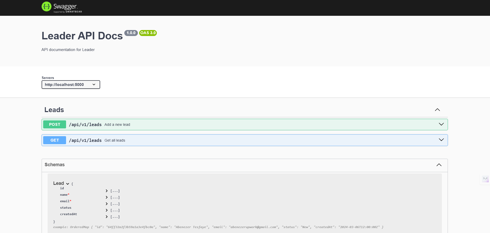
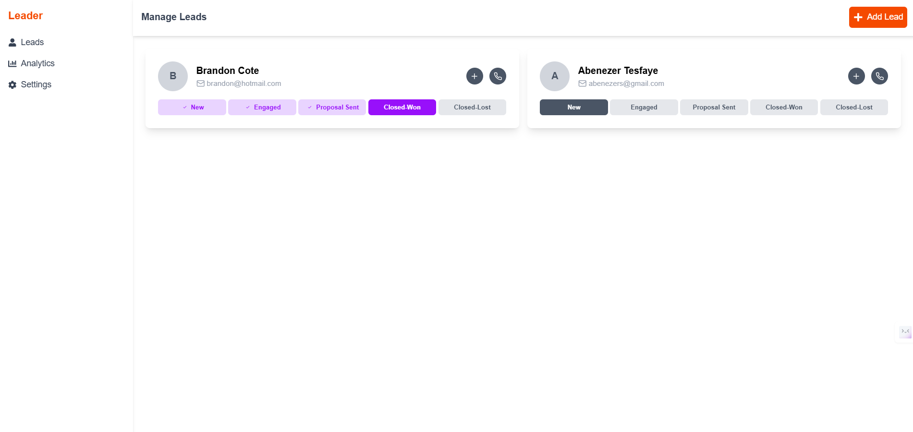
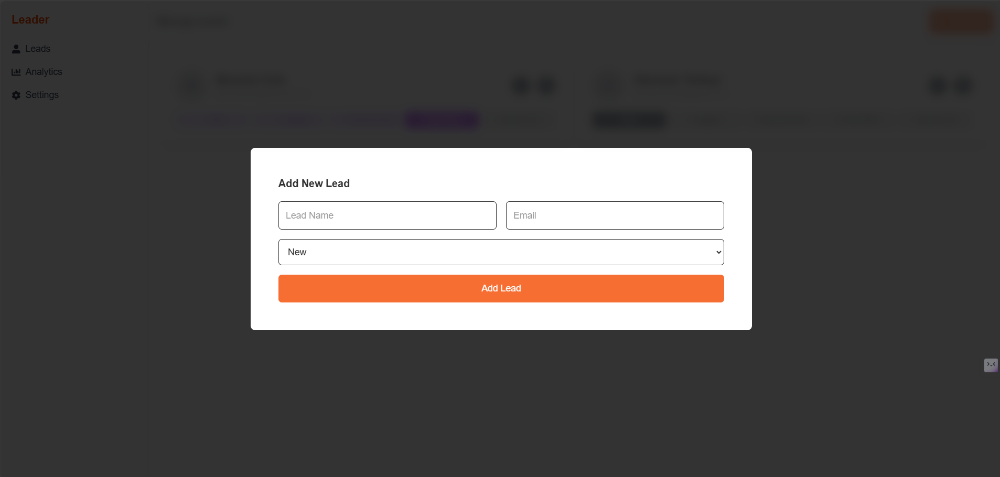

# Leader - A Simple Lead Management System

Leader is a lightweight and efficient lead management system designed to help businesses track and manage potential clients. With an intuitive UI, users can add and view leads seamlessly.

## 📌 Features

✅ Add, view, and manage leads  
✅ Categorize leads by status  
✅ Clean and responsive UI  
✅ Toast notifications for user feedback

---

## 🛠️ Installation & Setup

Follow these steps to set up Leader locally on your machine.

### 1 **Clone the Repository**

```bash
git clone https://github.com/kecheste/leader.git
cd leader
```

### 2 **Install Dependencies**

Ensure you have Node.js (>=16) installed

**For Next.js Frontend**

```bash
cd frontend
npm install
```

**For Node.js Backend**

```bash
cd server
npm install
```

### 3 **Setup Environment Variable**

For the Backend, rename .env.example to .env then add mongoDB url and the next.js frontend URL
It should look something like this

```bash
PORT=5000
MONGO_URI=mongodb://localhost:27017/leader
NEXT_PUBLIC_FRONT_URI=http://localhost:3000
```

For the frontend, rename .env.example to .env then add the node.js backend api url
It should look like this

```bash
NEXT_PUBLIC_API_URL=http://localhost:3000/api/v1
```

### 4 **Run the Development Server**

Ensure you have:

- MongoDB installed
- Node.js(>=16)

To run the backend, navigate to the backend folder

```bash
cd server
nodemon server.js
```

To run the frontend, navigate to the frontend folder

```bash
cd frontend
npm run dev
```

Your app should now be running at http://localhost:3000

---

## Swagger UI to test the API

After running the backend server, you can access Swagger UI in your browser at: http://localhost:5000/api-docs



### How to Use Swagger UI

Open your browser and navigate to http://localhost:5000/api-docs.
You'll see a user-friendly interface listing all available API endpoints.
Click on an endpoint to expand its details.
Fill in the required parameters (if any) and click **Try it out**.
Click **Execute** to send the request and see the response.
The response will be displayed below, showing the status code, response body, and headers.

#### Example API Endpoints

Method Endpoint Description

- GET /leads Fetch all leads
- POST /leads Create a new lead

#### Adding More API Endpoints

If you want to add more API endpoints to Swagger UI, check **leadsRoutes.js** file.

---

## How to Use the App

### 1️ **Dashboard Overview**

View existing leads and statuses.



### 2️ **Adding a New Lead**

Click "Add Lead," fill in the form, and submit.


